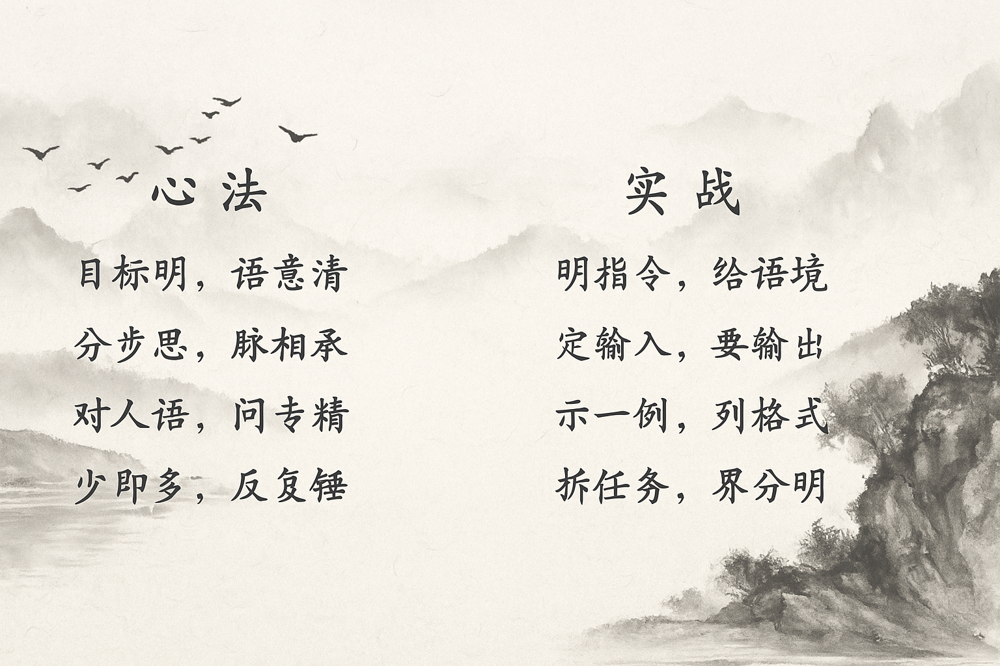

# LLM 提示工程（Prompt Engineering）入门

> ——教你写出让大模型“听话又聪明”的 Prompt

------

## 一、什么是提示工程？

提示工程（Prompt Engineering）是**通过设计输入内容，引导 LLM 产生高质量输出的技术与艺术**。
 简单来说：

> 你对大模型说什么、怎么说，决定了它给你什么样的答案。

Prompt = 指令 + 背景 + 输入 + 输出要求

一个好的 Prompt，就像给模型画出清晰的路线图。
 这正是提示工程的核心使命：**让 AI 理解“你真正想要什么”**。

📘 延伸阅读：[Google 官方定义 - What is Prompt Engineering?](https://cloud.google.com/discover/what-is-prompt-engineering?hl=zh-CN)

------

## 二、为什么提示工程如此重要？

因为 LLM 没有“常识”与“意图识别能力”，它只是基于概率预测下一个词。
 一个模糊的提问，模型就会“自由发挥”；一个精准的 Prompt，则能让输出稳定可靠。

| 类型   | 示例                                                         | 输出表现                     |
| ------ | ------------------------------------------------------------ | ---------------------------- |
| ❌ 模糊 | “帮我写报告”                                                 | 结构混乱，内容不相关         |
| ✅ 清晰 | “请帮我写一篇500字、面向小学生的气候变化科普文章，语气活泼。” | 结构完整，语气匹配，目标明确 |

------

## 三、谁需要掌握提示工程？

几乎所有与 LLM 打交道的人都需要：

- **开发者**：写出精确的系统 Prompt，控制输出格式。
- **设计者 / 产品经理**：优化对话体验，让 AI 回答更符合人类预期。
- **教育者 / 创作者**：提升生产效率，让 AI 成为创意助手。

掌握提示工程 ≈ 掌握大模型交互的“操作系统”。

------

## 四、如何写出高效 Prompt？

### 1. 四要素结构

| 要素                    | 说明                     | 示例                                       |
| ----------------------- | ------------------------ | ------------------------------------------ |
| **指令（Instruction）** | 明确你希望模型执行的任务 | “总结以下文本的主要观点”                   |
| **上下文（Context）**   | 提供背景或额外说明       | “你是一位专业历史老师”                     |
| **输入（Input）**       | 任务材料                 | “秦始皇统一六国后……”                       |
| **输出（Output）**      | 格式或风格要求           | “请用三点总结，并用 Markdown 列表形式输出” |

------

### 2. 优质 Prompt 的 6 个标准

1. **清晰具体**：说清楚“做什么”和“做到什么程度”
2. **量化指标**：例如“200字以内”、“列3点”
3. **分步骤（思维链）**：让模型先思考再回答
4. **给示例（few-shot）**：展示你想要的输出样式
5. **一次只做一件事**：避免多任务混乱
6. **自然语言交互**：像说话一样清楚自然

------

### 3. 示例讲解

#### Zero-shot（零样本）

> 模型完全靠自身理解完成任务。

```
请用一句话解释什么是量子计算。
```

#### One-shot（单样本）

> 给一个示例，让模型模仿格式。

```
示例：
输入：猫
输出：一种长有胡须的小型毛茸茸哺乳动物。

现在请生成：
输入：狗
```

#### Few-shot（少样本）

> 提供多个样本，引导模型学会复杂任务。

```
示例1：
输入：苹果
输出：一种红色或绿色的水果。

示例2：
输入：胡萝卜
输出：一种橙色的根茎类蔬菜。

现在请生成：
输入：香蕉
```

------

### 4. 思维链（Chain-of-Thought）和ReAct机制

#### CoT - 推理思考

> “让模型自己想一想”

让模型把“中间推理步骤”写出来，不是只给答案，而把思路拆成一步步的、可读的推导过程

```
请逐步推理并回答：
小明有5个苹果，吃掉2个，还剩多少？
```

输出：

> 第1步：5个苹果
> 第2步：吃掉2个
> 第3步：剩下3个

#### ReAct - 具体行动

Reason + Action = ReAct

同时让模型“思考（Reason）”并发出“动作（Action）”，动作通常需要调动外部工具和插件来执行。


#### 实践经验

- 纯推理/解释性问题 → **CoT**（直接让模型把步骤写清楚）。

- 需要外部数据/执行任务 → **ReAct**（模型同时思考并发出工具调用）。

- 复杂决策且需可审计 → 可以把两者结合：ReAct 做数据采集/执行，CoT 做最终推理与解释。

  

------

### 5. LLM常用参数调节

参考上一个章节

| 参数                  | 含义          | 建议值   | 说明                          |
| --------------------- | ------------- | -------- | ----------------------------- |
| **temperature**       | 创造力/随机性 | 0~1.0    | 越高越有创造性，越低越确定    |
| **top_p**             | 词汇选择范围  | 0.9~0.95 | 一般与 temperature 二选一调节 |
| **max_length**        | 输出字数上限  | 256~2048 | 控制成本                      |
| **frequency_penalty** | 降低重复度    | 0~2      | 避免模型重复输出              |
| **stop_sequences**    | 停止标识      | 可选     | 控制生成终止                  |

------

### 6. 提示工程快速模板

**结构化模板（推荐）**

```
# 角色设定
你是一名{专业角色}。

# 任务目标
你的任务是{目标描述}。

# 输入内容
{输入材料}

# 输出要求
请以{格式/语气/长度}输出结果。
```

**例子：**

```
你是一名儿童心理专家。
请用简洁的语言解释“情绪管理”的意义，
面向对象是3~5岁儿童的家长。
输出不超过100字。
```

------

## 五、进阶学习与实践资源

| 类型         | 推荐资源                                                     | 说明                     |
| ------------ | ------------------------------------------------------------ | ------------------------ |
| 📘 GitHub教程 | [dair-ai / Prompt-Engineering-Guide](https://github.com/dair-ai/Prompt-Engineering-Guide) | 最权威的开源指南         |
| 🧩 官方课程   | [Google Cloud 提示工程实践](https://cloud.google.com/blog/products/application-development/five-best-practices-for-prompt-engineering) | 官方5大最佳实践          |
| 💡 阅读推荐   | *“Prompt Engineering for Everyone” by DeepLearning.AI*       | 入门课程，浅显易懂       |
| 🧠 实战平台   | OpenAI Playground / 阿里通义千问 Playground                  | 调参数、测效果的最好方式 |

------

## 小结

> Prompt 工程的本质，是“用语言进行编程”。

- 语言越具体，AI越聪明
- 结构越清晰，输出越稳定
- 逻辑越分明，推理越准确

最后，分享一下自己探索无数遍后总结的心法口诀（本人的法定电脑桌面，时刻提醒自己）。

真原创，超级浓缩版本，谁看懂了谁受益🙂



---

## 六、参考文献

### 核心资源

1. **Google Cloud (2023).** "What is Prompt Engineering?" [官方定义](https://cloud.google.com/discover/what-is-prompt-engineering?hl=zh-CN)

2. **Google Cloud (2023).** "Five Best Practices for Prompt Engineering." [最佳实践](https://cloud.google.com/blog/products/application-development/five-best-practices-for-prompt-engineering)

### 开源指南

- [dair-ai / Prompt-Engineering-Guide](https://github.com/dair-ai/Prompt-Engineering-Guide) - 最权威的开源提示工程指南

### 相关论文

1. **Wei, J., et al. (2022).** "Chain-of-Thought Prompting Elicits Reasoning in Large Language Models." *Advances in Neural Information Processing Systems*, 35. [arXiv:2201.11903](https://arxiv.org/abs/2201.11903)

2. **Yao, L., et al. (2022).** "ReAct: Synergizing Reasoning and Acting in Language Models." *arXiv preprint arXiv:2210.03629*. [链接](https://arxiv.org/abs/2210.03629)

### 在线课程

- [DeepLearning.AI: Prompt Engineering for ChatGPT](https://www.deeplearning.ai/short-courses/chatgpt-prompt-engineering-for-developers/) - 提示工程专项课程
- [Coursera: Prompt Engineering](https://www.coursera.org/learn/prompt-engineering) - 提示工程在线课程

### 实践平台

- [OpenAI Playground](https://platform.openai.com/playground) - OpenAI官方测试平台
- [通义千问 Playground](https://tongyi.aliyun.com/) - 阿里云测试平台